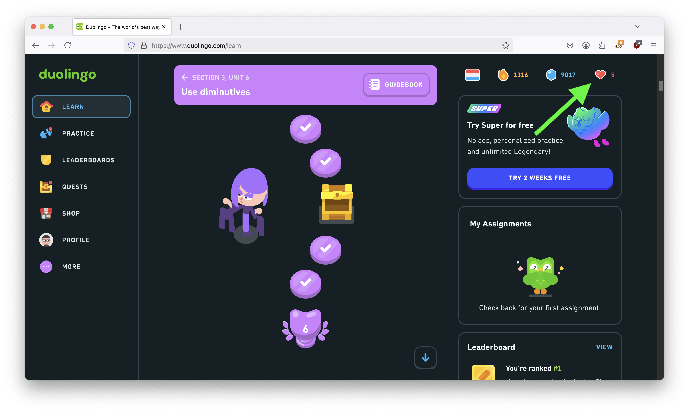
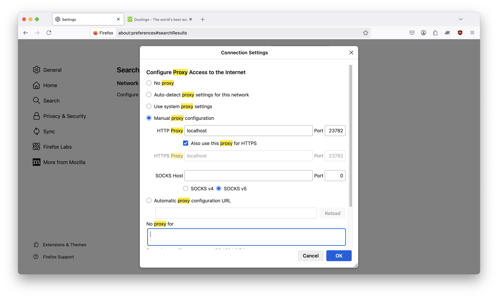
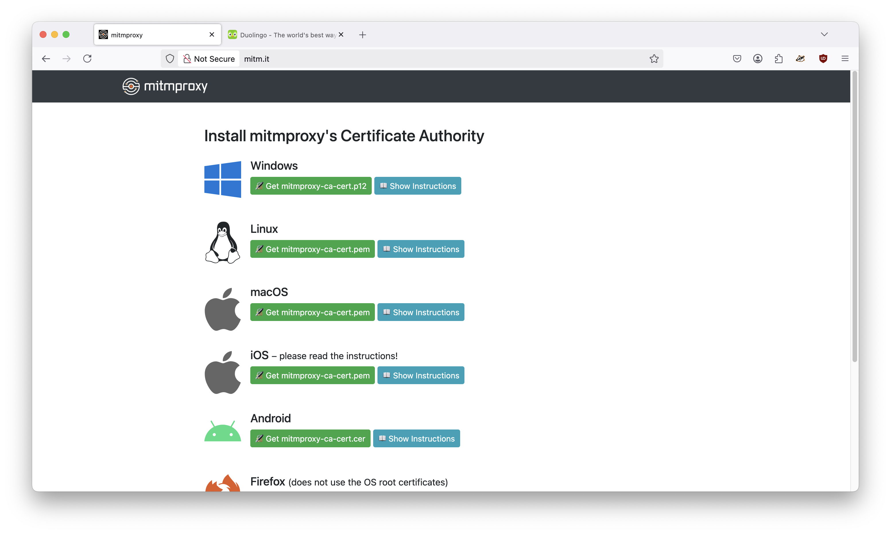

## Proxy for free unlimited hearts on Duolingo (web)

This project demonstrates how to setup a simple proxy that will intercept the web traffic from Duolingo when visited *from a web browser*, and alter it so as to enable unlimited hearts.



## Setup
You can run this:
- on your local machine and intercept only requests from web browsers running on this same machine
- set it up on a remote machine and connect several devices/browsers.

### Getting started
1) Clone the repository and start the container
```
git clone https://github.com/MachXNU/Duolingo-proxy.git
cd Duolingo-proxy
docker compose up -d
```

2) Connect a web browser to this proxy. For example in Firefox:



3) Visit [mitm.it](http://mitm.it) and check the proxy is running. Also install the CA certificates for your platform.



4) **Done!** Visit [duolingo.com](https://duolingo.com) and enjoy free unlimited hearts!


## Further customizations
- As usual, you can change the port exposed on the host machine in the `docker-compose.yml` file.
- It may be a good idea to add [authentication](https://docs.mitmproxy.org/stable/overview-features/#proxy-authentication) to your proxy
- If running this remotely, don't forget to forward port `23782` (or whatever port you chnaged it to) on your router.