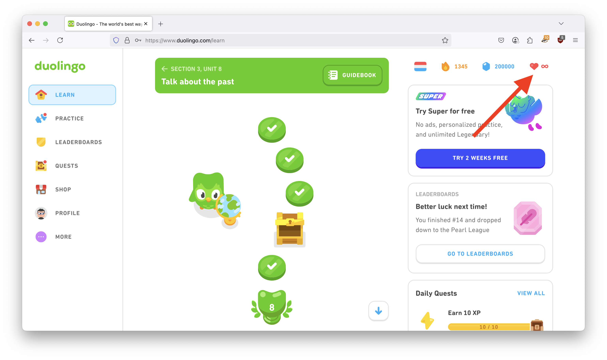

## Proxy for free unlimited hearts on Duolingo (web + iOS)

This project demonstrates how to setup a simple proxy that will intercept the web traffic from Duolingo when visited *from a web browser* or *from the iOS app*, and alter it so as to enable unlimited hearts (and also lots of gems :) ).

<p align="center">
  
  
</p>

## Setup
You can run this:
- on your local machine and intercept only requests from web browsers running on this same machine (only for the web version)
- set it up on a remote machine and connect several devices/browsers (including the mobile version)

### Getting started (web version)
1) Clone the repository and start the container
```
git clone https://github.com/MachXNU/Duolingo-proxy.git
cd Duolingo-proxy
docker compose up -d
```

2) Connect a web browser to this proxy. For example in Firefox:


3) Visit [mitm.it](http://mitm.it) and check the proxy is running. Also install the CA certificates for your platform.


4) **Done!** Visit [duolingo.com](https://duolingo.com) and enjoy free unlimited hearts!


## On iOS
You can use [Potatso](https://apps.apple.com/us/app/potatso/id1239860606), and set up your proxy credentials here.

This app will route all your iPhone/iPad's traffic through your proxy using a VPN profile, which does apply to all apps, even when on mobile data.

**NB:** you may need to switch languages for the app to refresh completely and the hack to appear.

## Further customizations
- As usual, you can change the port exposed on the host machine in the `docker-compose.yml` file.
- It may be a good idea to add [authentication](https://docs.mitmproxy.org/stable/overview-features/#proxy-authentication) to your proxy
- If running this remotely, don't forget to forward port `23782` (or whatever port you chnaged it to) on your router.